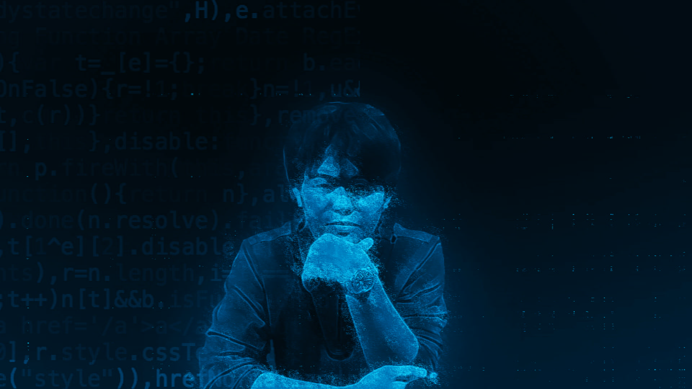

# portfolio-one

# Raysthetics Portfolio



A modern and responsive portfolio website showcasing design work, projects, and professional experience. Built with performance and aesthetics in mind.

## ✨ Features

-   **Dark/Light Theme Toggle**  
    System-aware theme switching with smooth transitions
-   **Interactive Animations**  
    Typewriter effect, floating words, and scroll-triggered card transitions
-   **Responsive Design**  
    Mobile-first approach with hamburger menu for smaller screens
-   **Project Showcases**  
    Organized presentation of mobile, web, and design projects
-   **Contact Form**  
    Functional contact section (PHP backend placeholder included)

## 🛠 Technologies

-   [Pico CSS](https://picocss.com/) - Minimal CSS framework
-   [Font Awesome](https://fontawesome.com/) - Icons
-   [Lordicon](https://lordicon.com/) - Animated icons
-   [Typed.js](https://mattboldt.com/demos/typed-js/) - Typewriter effect
-   [Owl Carousel](https://owlcarousel2.github.io/OwlCarousel2/) - Content slider (standby implementation)

## 🚀 Installation

1. Clone repository:
    ```bash
    git clone https://github.com/yourusername/raysthetics-portfolio.git
    ```
